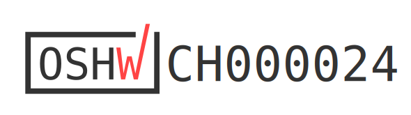

<!-- badges: start -->

<!-- badges: end -->

<h1> Sensing improved cookstoves to estimate CO2 emission reduction </h1>

<b>Contributors</b>  
- Timon Mettler <a href="https://orcid.org/">
 0000-0002-6187-2617
</a> *author, developer*  
- Jakub Tkaczuk <a href="https://orcid.org/0000-0001-7997-9423">
 0000-0001-7997-9423
</a> *supervisor, maintainer*  
- Elizabeth Tilley <a href="https://orcid.org/0000-0002-2095-9724">
 0000-0002-2095-9724
</a> *supervisor*  

 

 

  
This work is certified by the Open Source Hardware Association. 

  
It compliments the openly-accessible master’s thesis, available on the   
<a href="">ETH Research Collection</a>.

# Background

This repository compliments the bachelor's thesis on developing the sensor system for estimating the emission reduction though improved cookstove usage. Hardware created within this project lays the foundations for establishing accurate and easy to operate hardware for obtaining carbon certificates under Paris Agreement. The thesis presents the design and implementation of a system for data collection and evaluation of the environmental impact of improved cookstoves compared to traditional models. The resulting system is open-source, reliable, and cost-effective. It uses Raspberry Pi Pico to collect data from a thermocouple and a scale to measure the runtime and wood consumption of cookstoves. Designed for deployment in remote areas lacking electricity and Wi-Fi connectivity, the system operates using solar panels and transmits sensor data to a cloud-based server via a cellular connection. By providing precise and reliable data, the system enhances the accuracy of emissions calculations associated with cookstoves. The work presented in the thesis and this repository serves as a comprehensive guide for creating a robust, cost-efficient, and remotely deployable data logging solution, contributing to the accurate assessment of CO2 emissions savings and supporting climate change mitigation efforts.

# Hardware

Hardware used in the project:
- Microcontroller (Raspberry Pi Pico) serves as the central processing unit to manage data acquisition and transmission.
- Micro SD card module and micro SD card allows storing the sensor data locally.
- SIM7670E Cellular modem enables reliable data transmission over cellular networks.
- Load cells and the HX711 load cell amplifier measure the weight of wood consumed by the cookstove.
- K-type thermocouple and AD8495 thermocouple amplifier measure cookstove temperature.
- PCF8523 Real-Time Clock provides accurate timestamps for collected data.
- Waveshare solar power management module (D) ensures continuous power supply by managing the batteries and solar panels.
- Three 18650 Li-ion batteries are selected for their energy density and reusability.
- Two 10 W, 12 V solar panels supply energy to charge the batteries in remote environments.
- LM3940 voltage regulator regulates the voltage from 5 V to 3.3 V to ensure safe operation.
- TRU COMPONENTS KST 220 enclosure provides a protective casing for the hardware.

| name | source | approximate price [CHF] |
| ---- | ------ | ----------------------- |
| Raspberry Pi Pico | [Pi-Shop](https://www.play-zone.ch/de/raspberry-pi-pico-rp2040.html) | 3.90 |
| Micro SD card module | [bastelgarage](https://www.bastelgarage.ch/wemos-d1-mini-micro-sd-shield?search=micro%20sd%20card) | 4.90 |
| Micro SD card | [Digitec](https://www.digitec.ch/de/s1/product/intenso-micro-secure-digital-card-micro-sd-class-10-microsdhc-4-gb-u1-speicherkarte-9856410) | 4.50 |
| SIM7670E module | [Mikroshop](https://mikroshop.ch/Zubehoer.html?gruppe=10&artikel=1345) | 26.50 |
| 3 x load cells + HX711 load cell amplifiers | [Conrad](https://www.conrad.ch/de/p/joy-it-sen-hx711-20-waegezelle-1-st-2475886.html) | 18.05 |
| K-type thermocouple | [Distrelec](https://www.distrelec.ch/en/thermocouple-500mm-plug-1100-type-5mm-stainless-steel-rnd-rnd-410-00301/p/30386880?redirectQuery=303-86-880) | 23.00 |
| AD8495 thermocouple amplifier | [Adafruit](https://www.adafruit.com/product/1778) | 10.85 |
| Solar power management module (D) | [Waveshare](https://www.waveshare.com/solar-power-manager-d.htm) | 11.75 |
| 3 x 18650 Li-ion batteries | [bastelgarage](https://www.bastelgarage.ch/li-ion-battery-3-7v-3200ma-ncr18650b-18650-with-button-terminal) | 26.70 | 
| 2 x 10 W, 12 V solar panels | [Amazon](https://www.amazon.com/dp/B0D5QM3PMK?__mk_de_DE=%C3%85M%C3%85%C5%BD%C3%95%C3%91&crid=29UPTHT6OMG2H&dib=eyJ2IjoiMSJ9.Uy2Uu7maPBSJYLTfZK1LU1--gf4QtYxjgoMAzGwnjEeb_VUWnVagijMJVMsM3F5YXn-1zkDn3ojGTdi4rdTLDgqu22oPA3eht6cJWwbp_VdqLJh34eKp9MvBRtGYAw-m1U4V7yqD1gdNE0uOlQRznMuQJcQVpNviweuHjPjO6NZMYO1Y07mTqTMklVKEHtNNlQTo_4Zmcw6VHXO7i6vRkwBmkj677COpmpOzH_31p1s.bTGDVtsk52iwjnh80MYHbE0vXSHwOu2P5XdJRXxDrUY&dib_tag=se&keywords=12V+10W+solar+panel&qid=1738977216&sprefix=12v+10w+solar+pan%2Caps%2C640&sr=8-1-spons&sp_csd=d2lkZ2V0TmFtZT1zcF9hdGY&psc=1) | 25.00 |
| LM3940 voltage regulator | [Mouser](https://www.mouser.ch/ProductDetail/Texas-Instruments/LM3940IT-3.3-NOPB?qs=QbsRYf82W3FGrjqcSAbcdA%3D%3D) | 1.43 |
| TRU COMPONENTS KST 220 enclosure | [Conrad](https://www.conrad.com/en/p/tru-components-kst-220-03220000-h-industrial-grade-casing-160-x-80-x-55-acrylonitrile-butadiene-styrene-slate-grey-1-pc-1483224.html?refresh=true) | 12.99 |
| Cable connection sockets | [Jumbo](https://www.jumbo.ch/de/maschinen-werkstatt/elektro-material/kabel-stecker-schalter/kabelmanagement/kabelverschraubungen-m16-3-st/p/6915809?trackingtoken=product%7Carea2%7CA%7CStandardkampagne%7Cordered_together_PDP%7Cordered_together_PDP) | 3.00 |
| **TOTAL** | | **149.57** |

The dataflow between the hardware components is schematically represented below.

# Software

The `main.py` script follows the workflow presented on the figure below.

# Wiring diagram

The wiring diagram presents electrical connections between hardware.

# License

Both the thesis, published on the [ETH Research Collection]() and the underlying data, published in this repository are licensed under [Creative Commons Attribution 4.0 International](https://github.com/Global-Health-Engineering/cookstove-sensing/blob/main/LICENSE.md).
